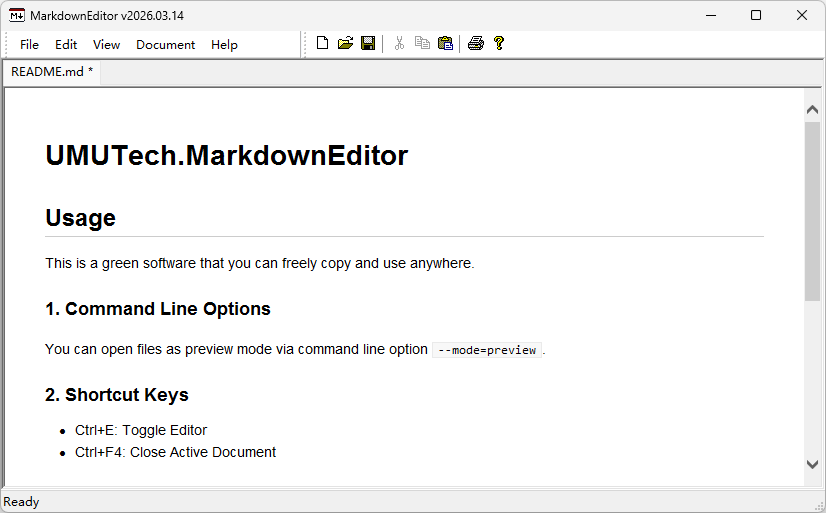
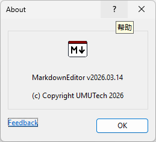

# UMUTech.MarkdownEditor

## Deprecation notice

This repo has been superseded by [UMU618/MarkdownEditor2](https://github.com/UMU618/MarkdownEditor2). This repo will no longer receive updates. Official updates will be located there from now on.

## Usage

This is a green software that you can freely copy and use anywhere.

### 1. Command Line Options

You can open files as preview mode via command line option `--mode=preview`.

By passing the "--singleton" option, the instance can be set to the singleton mode. In this case, any new instances opened later will activate this instance and then exit.

### 2. Shortcut Keys

- Ctrl+E: Toggle Editor
- Ctrl+F4/Ctrl+W: Close Active Document
- Ctrl+Tab: Next Tab
- Shift+Ctrl+Tab: Previous Tab

### 3. Note

- Only files encoded in UTF-8 are accepted.
- Line endings are always LF.
- Can't open files larger then 4MB.
- This software uses the outdated MSHTML control, which has poor compatibility. You should use [UMU618/MarkdownEditor2](https://github.com/UMU618/MarkdownEditor2), as it utilizes the modern [WebView2](https://github.com/MicrosoftEdge/WebView2Samples).

## Snapshots

